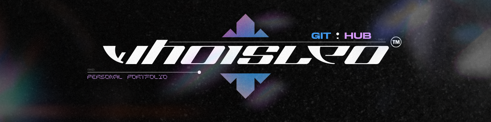

</img>

---

  <h1>Personal Portfolio</h1>

## About this project

𝐂𝐫𝐢𝐞𝐢 𝐞𝐬𝐬𝐞 𝐩𝐫𝐨𝐣𝐞𝐭𝐨 𝐜𝐨𝐦 𝐨 𝐩𝐫𝐢𝐧𝐜𝐢𝐩𝐚𝐥 𝐢𝐧𝐭𝐮𝐢𝐭𝐨 𝐝𝐞 𝐟𝐚𝐥𝐚𝐫 𝐮𝐦 𝐩𝐨𝐮𝐜𝐨 𝐦𝐚𝐢𝐬 𝐬𝐨𝐛𝐫𝐞 𝐪𝐮𝐞𝐦 𝐞𝐮 𝐬𝐨𝐮 𝐞 𝐜𝐨𝐧𝐭𝐚𝐫 𝐬𝐨𝐛𝐫𝐞 𝐦𝐢𝐧𝐡𝐚𝐬 𝐜𝐨𝐧𝐪𝐮𝐢𝐬𝐭𝐚𝐬. 𝐌𝐢𝐧𝐡𝐚 𝐢𝐝𝐞𝐢𝐚 𝐝𝐞 𝐝𝐞𝐬𝐢𝐠𝐧 𝐩𝐚𝐫𝐚 𝐞𝐬𝐬𝐞 𝐩𝐫𝐨𝐣𝐞𝐭𝐨 𝐟𝐨𝐢 𝐯𝐨𝐥𝐭𝐚𝐝𝐚 𝐩𝐚𝐫𝐚 𝐨 𝐞𝐬𝐭𝐢𝐥𝐨 𝐛𝐫𝐮𝐭𝐚𝐥𝐢𝐬𝐭𝐚 𝐞 𝐦𝐢𝐧𝐢𝐦𝐚𝐥𝐢𝐬𝐭𝐚, 𝐜𝐨𝐦 𝐢𝐜𝐨𝐧𝐞𝐬 𝐟𝐨𝐫𝐭𝐞𝐬 𝐞 𝐭𝐢𝐩𝐨𝐠𝐫𝐚𝐟𝐢𝐚𝐬 𝐜𝐡𝐚𝐦𝐚𝐭𝐢𝐯𝐚𝐬. 𝐄𝐬𝐬𝐚 𝐞𝐬𝐜𝐨𝐥𝐡𝐚 𝐞́ 𝐯𝐢𝐬𝐢𝐯𝐞𝐥 𝐧𝐚 𝐚𝐛𝐚 𝐝𝐞 𝐩𝐫𝐨𝐣𝐞𝐭𝐨𝐬, 𝐨𝐧𝐝𝐞 𝐜𝐚𝐝𝐚 𝐜𝐨𝐫 𝐫𝐞𝐩𝐫𝐞𝐬𝐞𝐧𝐭𝐚 𝐚 𝐫𝐞𝐬𝐩𝐞𝐜𝐭𝐢𝐯𝐚 𝐩𝐚𝐥𝐞𝐭𝐚 𝐝𝐞 𝐜𝐨𝐫𝐞𝐬 𝐮𝐭𝐢𝐥𝐢𝐳𝐚𝐝𝐚 𝐞𝐦 𝐜𝐚𝐝𝐚 𝐩𝐫𝐨𝐣𝐞𝐭𝐨. 𝐏𝐫𝐞𝐭𝐞𝐧𝐝𝐨 𝐬𝐞𝐦𝐩𝐫𝐞 𝐦𝐚𝐧𝐭𝐞𝐫 𝐞𝐬𝐬𝐞 𝐩𝐨𝐫𝐭𝐢𝐟𝐨́𝐥𝐢𝐨 𝐚𝐭𝐮𝐚𝐥𝐢𝐳𝐚𝐝𝐨, 𝐜𝐨𝐦 𝐧𝐨𝐯𝐨𝐬 𝐞𝐟𝐞𝐢𝐭𝐨𝐬, 𝐩𝐫𝐨𝐣𝐞𝐭𝐨𝐬 𝐞 𝐞𝐬𝐜𝐨𝐥𝐡𝐚 𝐚𝐫𝐭𝐢𝐬𝐭𝐢𝐜𝐚.

## Tools

𝐅𝐨𝐢 𝐮𝐭𝐢𝐥𝐢𝐳𝐚𝐝𝐨 𝐩𝐚𝐫𝐚 𝐜𝐫𝐢𝐚𝐜̧𝐚̃𝐨 𝐝𝐞𝐬𝐬𝐞 𝐩𝐫𝐨𝐣𝐞𝐭𝐨: 
 
✦ React Vite
 
✦ TailwindCSS
 
e diversos componentes do  **<a href="https://reactbits.dev/">𝐑𝐞𝐚𝐜𝐭 𝐁𝐢𝐭𝐬</a>**
 
 
---

